# colorFix
Using GAN to fix color in images. Implemented in Keras.

Project was made during free time on Thanksgiving. I had not much experience in ML.

Given an image, we can adjust the brightness and contrast by simply using the equation: Image = Image * alpha + beta (pixel-wise operation)
Of course, since Image are limited from 0 to 255, certain feature would be lost.
In this project, I attempt to fix the lost using GAN. So, basically given an image with wrong color using the alpha/beta transform, GAN will fix it.

## Discriminator:
I simply downsampling images, with a final FCN with sigmoid to check if the image got "good" coloring or not.
A simple MSE loss function.

## Generator:
An U-net. I downsample the original image (256,256) to (16,16) and upscale it (default upscale2d in keras), then concat the layers together.
No padding as it would create strange color striped border in my experience.
For loss function, I used SSIM (or D-SSIM: (1-SSIM)/2) with a L1 loss.

## Training:
Simply edit training.py and call python training.py

## Prediction:
I did not add the file for prediction here, will add later.

## Result:
I have just trained for about 10 epoches. The picture looks like it is becoming better. I will update the final result when available.
Many improvement could be done with the Generator, for example using Sub-pixel convolution instead of normal upscaling, better loss function and training scheme.
Any suggestions and help is appreciated, as I am just starting. Feel free to do PR.

### Epoch 4
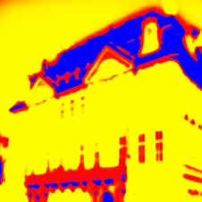 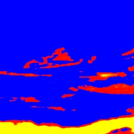 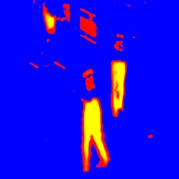 

### Epoch 10
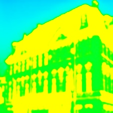 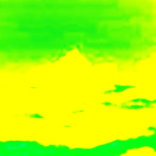 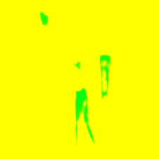 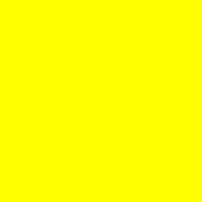

### Epoch 16
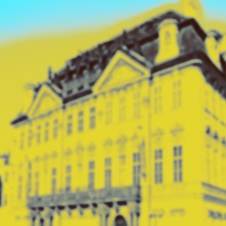  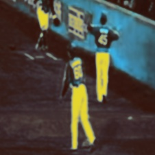 

### Epoch 20
 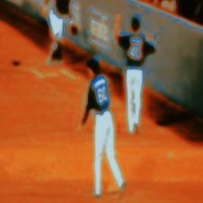 

### Epoch 26
 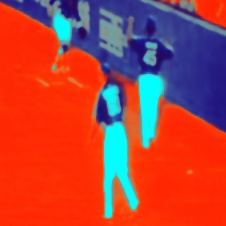 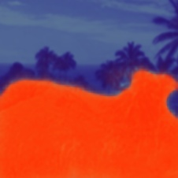

### Epoch 32 (Best so far, but there is some more training but the result worsen)
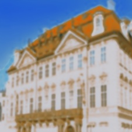 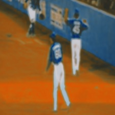 

## Plans:
I plan to finish my final exam before this. Any help would be appreciated.

## Update:
1. Changed the model from adding in U net to Concat. I think that how they did it originally, and it seems to have got better result.
Updates result are in images folder.

2. Change the model, both discriminator and generator to be more powerful. Trained for a few epoch and result looks good.

3. I believe there is currently a big problem. The generator does not seems to be training. I will investigate

4. I did not find a good balance between training the dicriminator and generator, so the result could actually be improved.
The generator as around 18 millions param, and i believe most GAN have more, so probably scaling the network could actually help.

